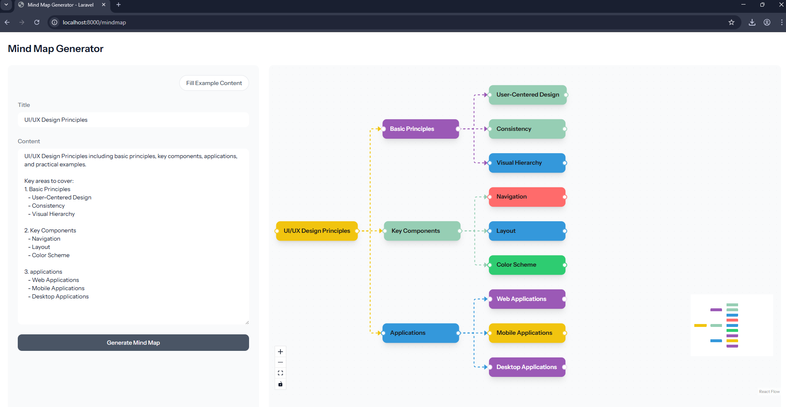

# Interactive Mind Map Application

A modern, interactive mind mapping application built with Laravel and React, featuring a dynamic and visually appealing interface for creating and viewing mind maps.



_Preview: UI/UX Design Principles Mind Map with color-coded sections and dotted line connections_

## Features

- **Interactive Mind Map Visualization**

    - Smooth, animated connections between nodes
    - Dotted line connections with color inheritance from parent nodes
    - Customizable node colors for different sections
    - Responsive node sizing based on content

- **Node Styling**

    - Main section nodes with distinct colors:
        - Basic Principles (Green)
        - Key Components (Orange)
        - Applications (Blue)
    - Child nodes inherit connection colors from parents
    - Automatic text color adjustment based on background brightness
    - Shadow effects and hover animations

- **Navigation & Controls**

    - Zoom in/out functionality
    - Interactive minimap for easy navigation
    - Draggable nodes and connections
    - Background grid for better visual orientation

- **User Interface**
    - Clean, modern design
    - Responsive layout
    - Loading states for better user experience
    - Smooth animations and transitions

## Technical Stack

- **Backend**

    - Laravel (PHP Framework)
    - Postgres Database

- **Frontend**
    - React
    - TypeScript
    - @xyflow/react (React Flow)
    - Tailwind CSS

## Getting Started

### Prerequisites

- PHP >= 8.1
- Node.js >= 16
- Composer
- Postgres

### Installation

1.  Clone the repository:

    ```bash
    git clone <repository-url>
    cd <project-directory>
    ```

2.  Install PHP dependencies:

    ```bash
    composer install
    ```

3.  Install JavaScript dependencies:

    ```bash
    npm install
    ```

4.  Copy the environment file:

    ```bash
    cp .env.example .env
    ```

5.  Generate application key:

    ```bash
    php artisan key:generate
    ```

6.  Configure your database in `.env` file:

        ```

    APP_NAME=Laravel
    APP_ENV=local
    APP_KEY=base64:c3PJa6loMajFliVxYFb5oa9lvRBjXNN/zUc6yzfxAiI=
    APP_DEBUG=true
    APP_URL=http://localhost

APP_LOCALE=en
APP_FALLBACK_LOCALE=en
APP_FAKER_LOCALE=en_US

APP_MAINTENANCE_DRIVER=file

# APP_MAINTENANCE_STORE=database

PHP_CLI_SERVER_WORKERS=4

BCRYPT_ROUNDS=12

LOG_CHANNEL=stack
LOG_STACK=single
LOG_DEPRECATIONS_CHANNEL=null
LOG_LEVEL=debug

DB_CONNECTION=pgsql
DB_HOST=127.0.0.1
DB_PORT=5432
DB_DATABASE=ai_app
DB_USERNAME=postgres
DB_PASSWORD=postgres

SESSION_DRIVER=file
SESSION_LIFETIME=120
SESSION_ENCRYPT=false
SESSION_PATH=/
SESSION_DOMAIN=null

BROADCAST_CONNECTION=log
FILESYSTEM_DISK=local
QUEUE_CONNECTION=database

CACHE_STORE=database

# CACHE_PREFIX=

MEMCACHED_HOST=127.0.0.1

REDIS_CLIENT=phpredis
REDIS_HOST=127.0.0.1
REDIS_PASSWORD=null
REDIS_PORT=6379

MAIL_MAILER=log
MAIL_SCHEME=null
MAIL_HOST=127.0.0.1
MAIL_PORT=2525
MAIL_USERNAME=null
MAIL_PASSWORD=null
MAIL_FROM_ADDRESS="hello@example.com"
MAIL_FROM_NAME="${APP_NAME}"

AWS_ACCESS_KEY_ID=
AWS_SECRET_ACCESS_KEY=
AWS_DEFAULT_REGION=us-east-1
AWS_BUCKET=
AWS_USE_PATH_STYLE_ENDPOINT=false

VITE_APP_NAME="${APP_NAME}"

OPENAI_API_KEY=
OPENAI_ORGANIZATION=
OPENAI_SSL_VERIFY=false
OPENAI_SSL_CERT_PATH=
```

7. Run migrations:
    ```bash
    php artisan migrate
    ```

### Development

1. Start the Laravel development server:

    ```bash
    php artisan serve
    ```

2. Start the Vite development server:
    ```bash
    npm run dev
    ```

## Usage

The mind map application allows you to:

- Create hierarchical mind maps with multiple levels
- Customize node colors and styles
- Add descriptions to nodes
- Navigate through the mind map using pan and zoom
- View an overview of the entire map using the minimap

## Component Structure

### MindMapViewer

- Main component for rendering the mind map
- Handles node and edge state management
- Processes color inheritance and styling
- Manages user interactions and layout

### CustomNode

- Renders individual nodes
- Handles node styling and appearance
- Manages connection points (handles)
- Implements color and opacity effects

## Contributing

1. Fork the repository
2. Create your feature branch (`git checkout -b feature/AmazingFeature`)
3. Commit your changes (`git commit -m 'Add some AmazingFeature'`)
4. Push to the branch (`git push origin feature/AmazingFeature`)
5. Open a Pull Request

## License

This project is licensed under the MIT License - see the LICENSE file for details.

## Acknowledgments

- [React Flow](https://reactflow.dev/) for the flow visualization library
- [Tailwind CSS](https://tailwindcss.com/) for the styling framework
- [Laravel](https://laravel.com/) for the backend framework
